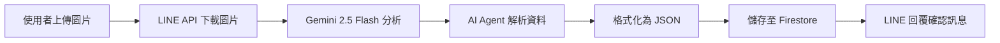
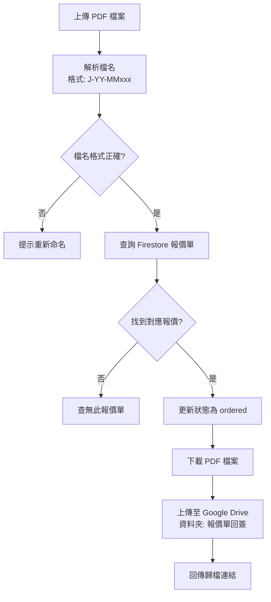

# React + Vite

This template provides a minimal setup to get React working in Vite with HMR and some ESLint rules.

Currently, two official plugins are available:

- [@vitejs/plugin-react](https://github.com/vitejs/vite-plugin-react/blob/main/packages/plugin-react) uses [Babel](https://babeljs.io/) (or [oxc](https://oxc.rs) when used in [rolldown-vite](https://vite.dev/guide/rolldown)) for Fast Refresh
- [@vitejs/plugin-react-swc](https://github.com/vitejs/vite-plugin-react/blob/main/packages/plugin-react-swc) uses [SWC](https://swc.rs/) for Fast Refresh

## React Compiler

The React Compiler is not enabled on this template because of its impact on dev & build performances. To add it, see [this documentation](https://react.dev/learn/react-compiler/installation).

## Expanding the ESLint configuration

If you are developing a production application, we recommend using TypeScript with type-aware lint rules enabled. Check out the [TS template](https://github.com/vitejs/vite/tree/main/packages/create-vite/template-react-ts) for information on how to integrate TypeScript and [`typescript-eslint`](https://typescript-eslint.io) in your project.

## System Architecture & Integrations

### n8n Automation (Backend)

The system relies on n8n workflows hosted at `jetenv.zeabur.app` for server-side operations:

- **Base URL**: `https://jetenv.zeabur.app`
- **Endpoints**:
  - Company Lookup (MOEA): `/webhook/ipas-conpanynumber`
  - Email Service: `/webhook/email`
  - LINE Bot Integration: `/webhook/money`

---

## n8n 報價系統工作流程

本系統透過 n8n 整合 LINE Bot、Google Firestore、AI Agent 等服務，提供完整的報價管理自動化流程。

### 主要功能

#### 1. LINE Bot 客戶互動

**Webhook 觸發點**: `/webhook/money`

系統透過 LINE Messaging API 與客戶互動，支援以下功能：

| 功能 | 觸發條件 | 處理流程 |
|------|---------|---------|
| 🤖 **幫助指令** | 使用者傳送「嗨」 | 回傳功能選單與使用說明 |
| 🔍 **查詢報價** | 訊息包含「查詢」 | AI Agent 查詢 Firestore 資料庫並回傳報價進度 |
| ➕ **文字新增客戶** | 訊息包含「新增」 | AI 解析文字資訊並存入客戶資料庫 |
| 📇 **名片識別新增** | 上傳圖片 | Gemini 2.5 Flash 識別名片內容並自動建檔 |
| 📄 **報價單回簽上傳** | 上傳 PDF 檔案 | 驗證檔名格式、更新狀態、上傳至 Google Drive |
| 💬 **AI 對話** | 一般文字訊息 | AI Agent 提供智慧回覆（含記憶功能） |

#### 2. 客戶資料管理

##### 名片自動識別流程



**儲存的客戶欄位**:

- `name`: 公司名稱
- `taxId`: 統一編號
- `contact`: 聯絡人姓名
- `phone`: 電話
- `address`: 地址
- `email`: 電子信箱
- `fax`: 傳真

**Firestore 路徑**: `artifacts/jietai-prod/public/data/customers`

#### 3. 報價單回簽處理

當客戶上傳回簽的報價單 PDF 時，系統會自動執行以下流程：



**檔名規則**: `J-YY-MMxxx-客戶名-案件名.pdf`

- 範例: `J-25-12001-傑太環境-廢水處理.pdf`

**Google Drive 資料夾 ID**: `1iGn4RDEqyfKKIjg19Y0CTzfXAMzOTYSC`

#### 4. 智慧查詢功能

使用者可透過自然語言查詢報價進度，AI Agent 會自動：

1. 連接 Firestore 資料庫（`artifacts/jietai-prod/public/data/quotations`）
2. 根據關鍵字搜尋報價單
3. 整理並回傳查詢結果

#### 5. AI Agent 配置

系統使用三個 AI Agent，各自負責不同任務：

| Agent | 模型 | 用途 | 特殊功能 |
|-------|------|------|---------|
| AI Agent | OpenRouter | 報價資料查詢 | 連接 Firestore Tool |
| AI Agent1 | OpenRouter | 客戶資料解析 | JSON 格式化輸出 |
| AI Agent2 | OpenRouter | 一般對話 | Session Memory |

**記憶功能**: AI Agent2 使用 `memoryBufferWindow` 保存對話歷史，以 LINE userId 作為 session key。

### Webhook 端點說明

#### 公司基本資料查詢 API

**端點**: `POST /webhook/ipas-conpanynumber`

**用途**: 查詢台灣公司登記資料（經濟部商工登記公示資料）

**參數**:

```json
{
  "query": {
    "taxId": "統一編號"
  }
}
```

**回傳**:

```json
{
  "found": true,
  "data": {
    "taxId": "統一編號",
    "name": "公司名稱",
    "status": "公司狀態",
    "representative": "負責人",
    "address": "公司地址",
    "capital": "資本額",
    "industryStats": ["營業項目1", "營業項目2"]
  }
}
```

**資料來源**:

- 公司基本資料: `data.gcis.nat.gov.tw` API `5F64D864-61CB-4D0D-8AD9-492047CC1EA6`
- 營業項目: `data.gcis.nat.gov.tw` API `426D5542-71FC-4547-9C54-30BDFE20C2CA`

#### 報價單寄送 API

**端點**: `POST /webhook/email`

**用途**: 將報價單 HTML 轉換為 PDF 並寄送給客戶

**參數**:

```json
{
  "body": {
    "to": "客戶信箱",
    "subject": "信件主旨",
    "quoteHtml": "報價單 HTML 內容",
    "quoteNumber": "報價單號",
    "clientContact": "客戶聯絡人",
    "grandTotal": "總金額"
  }
}
```

**處理流程**:

1. HTML to PDF 轉換（使用 `htmlcsstopdf` 服務）
2. SMTP 寄出郵件（從 `jetenv02@gmail.com`）
3. 附加 PDF 報價單檔案
4. 回傳狀態碼 200

**郵件範本**:

```text
{客戶聯絡人} 您好，

感謝您對傑太環境工程的信任與支持！

附件為「專案」之報價單（單號：{報價單號}），
報價總金額為 NT$ {總金額} 元（含稅）。

報價單如附件，
如有任何問題或需要調整，歡迎隨時與我們聯繫。

若報價內容無誤，請於報價單簽名處簽章後回傳，
我們將盡速安排後續作業。

祝 商祺

張惟荏
傑太環境工程顧問有限公司
電話：02-6609-5888 #103
網站：https://www.jetenv.com.tw/
```

### LINE Bot 設定

**LINE Channel**: 報價系統小幫手  
**Webhook URL**: `https://jetenv.zeabur.app/webhook/money`

**支援的訊息類型**:

- `text`: 文字訊息
- `image`: 圖片（名片識別）
- `file`: 檔案（報價單回簽）

**功能選單**:

```text
您好 我是傑太報價系統小幫手
有什麼可以幫您？
1. 查詢報價進度
(請先輸入 查詢 再輸入您要找的資料)
2. 新增客戶
(直接輸入文字 or 圖片檔名片)
3. 報價單簽回回傳歸檔
(請直接上傳 PDF 檔案 並以 J-XX-XXxxx 命名)
```

### 技術整合

| 服務 | 用途 | 憑證 |
|------|------|------|
| Google Firestore | 資料庫儲存 | Service Account |
| LINE Messaging API | 聊天機器人 | Channel Access Token |
| Google Gemini | 圖片識別 | API Key |
| OpenRouter | AI 對話 | API Key |
| Google Drive | 檔案歸檔 | OAuth2 |
| SMTP (Gmail) | 郵件寄送 | App Password |
| HTML to PDF | PDF 轉換 | API Key |
